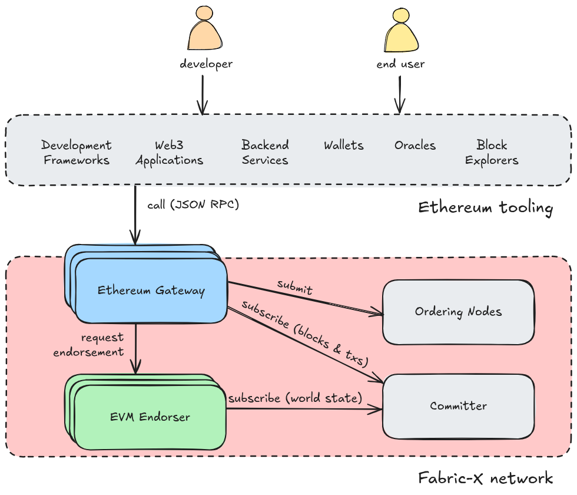

- Feature Name: Ethereum compatibility
- Start Date: 2025-11-26
- RFC PR: (leave this empty)
- Fabric-X Component: fabric-x-evm
- Fabric-X Issue: (leave this empty)

# Summary
[summary]: #summary

This proposal makes Fabric-X compatible with the Ethereum ecosystem. It adds an
Ethereum-style API and support for running smart contracts within its
permissioned environment. The goal is to combine the rich Ethereum tooling and
contract ecosystem with Fabric-X's strong endorsement and consensus model. By
embedding an Ethereum Virtual Machine (EVM) inside Fabric-X, developers can
reuse existing Ethereum logic without rewriting it for Fabric-X. This
integration aims to make Fabric-X more versatile for enterprise use cases that
require both the security and governance of Fabric-X and the programmability of
Ethereum. The approach preserves Fabric-X's transaction flow, trust guarantees
and high performance while enabling seamless use of the Ethereum development
toolchain, ultimately broadening the platform's appeal and lowering the barrier
for organizations that want to leverage existing Ethereum assets in a
permissioned setting.

*NOTE: Throughout this document, Fabric-X denotes both Fabric and Fabric-X,
since the integration that we describe here is applicable to both platforms.*

# Motivation
[motivation]: #motivation

The motivation for this feature is to make it easier for organizations already
familiar with Ethereum smart contracts to explore and adopt Fabric-X. Many
enterprises have invested in Solidity-based solutions and tooling, and this
integration provides a smooth path to port those assets into a permissioned
environment without starting from scratch. By doing so, they can quickly test
Fabric-X's capabilities and experience all advantages of pre-order execution and
Fabric-X's robust governance model.

The expected outcome is a platform that combines the best of both worlds: the
rich ecosystem and flexibility of Ethereum with the enterprise-grade trust and
scalability of Fabric-X. This enables use cases such as complex business
workflows, tokenization, and interoperable applications, while maintaining
compliance and control. Ultimately, this feature lowers the barrier to entry for
organizations considering Fabric-X, accelerates migration, and positions the
platform as a compelling choice for enterprises seeking both innovation and
reliability.

# Guide-level explanation
[guide-level-explanation]: #guide-level-explanation

Fabric-x now supports the Ethereum API as well as Ethereum smart contracts
through an embedded Ethereum Virtual Machine (EVM). This means you can deploy
and invoke Solidity contracts directly within Fabric-X, while still benefiting
from Fabric-X's endorsement, ordering, and permissioned security model. Think of
this as adding a new execution environment alongside your existing views (or
chaincodes for Fabric-X).

The Ethereum Gateway is the component that bridges Fabric-X and the EVM. When
you submit a transaction targeting an Ethereum contract, the gateway requests
endorsement from a set of endorsers. The endorsers execute the contract within
the EVM and capture all state changes as a signed, Fabric-X-compatible read-write
set (rwset). This rwset is then committed like any other Fabric-X transaction.
This means the transactions look and behave like Fabric-X transactions in terms of
endorsement and finality, while from the outside they look and behave like any
other Ethereum- compatible transaction.

With the integration, interacting with Fabric-X feels familiar yet seamlessly
aligned with Fabric-X's transaction model. Developers begin by deploying a
contract through the Fabric-X Ethereum Gateway API, using the familiar Ethereum
JSON RPC. The process involves providing the compiled Solidity bytecode, after
which the system records the contract metadata on the Fabric-X ledger. Once
deployed, the contract is ready for invocation just like any other Fabric-X
asset.

Invoking a contract is equally straightforward. An Ethereum transaction is
submitted containing the ABI-encoded function call and any required arguments,
through the Ethereum JSON RPC by specifying the contract address, the method to
execute, and its parameters. Fabric-X then runs the contract inside the EVM,
captures all resulting state changes, and processes them through the standard
endorsement and ordering flow. Any complexity of the Fabric-X endorsement and
ordering flow is abstracted away from the developer.

EVM integration in Fabric-X introduces a new way to approach smart contract
development while preserving the principles that make Fabric-X unique. For
developers already familiar with Fabric-X, think of Solidity contracts as an
alternative runtime to chaincode/views: the endorsement policies, ordering, and
MVCC checks remain unchanged. What differs is the execution environment:
Ethereum semantics now run inside Fabric-X's permissioned model. This means you
can reuse existing Ethereum logic without compromising the trust guarantees and
governance you expect from Fabric-X. At the same time, you have the support of
the full set of Ethereum developer tooling, SDKs and end user wallets.

For those coming from the Ethereum world, imagine Fabric-X as an
enterprise-grade instance of an Ethereum-style network where consensus is fast,
participation is controlled, and transactions are endorsed rather than mined.
You still write Solidity, but you no longer worry about gas fees, throughput or
block confirmations. Instead, you gain high concurrency, quick finality and
strong governance under Fabric-X's endorsement model. In short, this feature
allows you to think about smart contracts as portable business logic: the same
code can now operate in a high-performance, permissioned setting without losing
its original semantics.

# Reference-level explanation
[reference-level-explanation]: #reference-level-explanation

This section explains the feature in enough detail for a Fabric-X contributor to
understand how it fits into the platform, how it is implemented, and how to
reason about edge cases. It revisits the deployment and invocation examples and
shows how the internals make those scenarios work end-to-end.

## Architectural overview and interaction with existing features

This proposal adds two modular components that can be deployed to any new or
existing fabric or Fabric-X network. Internal identity and communication aligns
fully with the Fabric-X Membership Service Provider (MSP) and policies, so
anyone able to operate a Fabric-X network should be able to add Ethereum
compatibility with relative ease.



The **Ethereum Gateway** is the API. A Fabric-X network can have several
Gateways run by different organizations, or may decide to allow only one
(subject to governance policies). **EVM Endorsers** execute and endorse
Ethereum-style transactions on top of the latest world state. They get their
state updates from their Committer.

1. The Gateway takes in Ethereum-style transactions and forwards them to a set
of EVM Endorsers via a GRPCS API compatible with fabric version 3.x proposals.
2. Internally, the EVM Endorser drives a `go-ethereum` EVM instance per
transaction simulation.
3. Instead of writing directly to a persistent state database, the EVM interacts
with a `StateDB` wrapper that behaves like a read-only view for getters and a
recorder for mutations. To be compatible with EVM semantics, the wrapper will
expose read-own-writes semantics, differently from what Fabric-X users are used
to. The wrapper builds a Fabric-X-style read-write set (rwset) that captures all
keys read (with their versions) and all keys written by the EVM call.
4. The EVM Endorsers send back their signed responses.
5. The Gateway packages the rwset and endorsements in a Fabric-X transaction,
signs it and submits it to the Ordering nodes. It is subscribed for finality
updates on the Committer.
6. The Gateway keeps the new block and transaction metadata in its local state
   and returns a transaction receipt to the caller.

From the point of view of other Fabric-X features, EVM transactions are ordinary
Fabric-X transactions: they participate in endorsement, ordering, MVCC validation,
access control, auditing, and observability in exactly the same way as chaincodes/views.

The feature interacts cleanly with existing components:

- Endorsement: EVM transactions use the same policies. Endorsers perform the
simulation deterministically, reconstructing the same rwset, the read-write set
commits to a Fabric-X namespace whereupon an endorsement policy is defined: the
transaction will therefore only commit if it is properly endorsed, like any
other transaction.
- MVCC validation: The rwset produced by the StateDB wrapper is validated
against the committed versions. Conflicts are handled identically to other
Fabric-X transactions. Crucially, EVM transactions touching different parts of
their ledger state can be endorsed in parallel and enjoy the full scalability of
Fabric-X.
- Ordering and finality: Commit is governed by the standard ordering service.
- Identity and access control in this model operate on two complementary
layers. Endorsing peers will only simulate and endorse a transaction if the
submitting identity satisfies the configured Fabric-X policies. Inside the
EVM, the sender of the message as set in the execution context (`msg.sender`)
behaves exactly as in Ethereum: the contract can rely on it for authorization
checks, because the transaction payload is signed by the invoker and the system
verifies this before execution.  The Gateway and Endorsers are configured with
their own Fabric-X identity. This means contracts can continue to use
Ethereum-style logic to enforce execution access control, while Fabric-X
provides an additional governance layer to ensure that only authorized
participants can invoke or commit transactions.

## Naming and data model

Each deployed contract is identified by a contract address derived from the
deployment transaction (or explicitly assigned) and associated metadata: ABI,
bytecode hash, and deployment parameters. Persistent storage follows Ethereum
semantics (32-byte slots). The `StateDB` wrapper maps slots onto ledger keys of
the form:

```
evm/<contract-address>/<slot-key>
```

where `<slot-key>` is the canonical 32-byte index, including EVM's
keccak-derived layout for mappings and dynamic arrays. This mapping ensures
deterministic reconstruction of rwsets across endorsers. Transient EVM data
(memory, stack...) never touches the ledger.

## Execution lifecycle

When you deploy a contract, the endorser creates an EVM with a deployment
context, runs the constructor with the provided bytecode and arguments, records
storage mutations in the rwset, and registers the contract metadata on the
ledger.

When you invoke a contract, the endorser constructs the EVM with a call context
that sets `msg.sender`, `msg.value` (if value transfers are enabled), and the
current block context. The block context provides parameters used by opcodes
such as `NUMBER` and `TIMESTAMP`. In Fabric-X, these are derived
deterministically from the current channel state.

Gas is tracked to bound execution and prevent runaway computations. Fabric-x
enforces a per-transaction gas limit configurable at the channel or application
level. Gas is metering only; no fees are charged. If the execution exceeds the
limit, the transaction reverts and no writes enter the rwset.

## Determinism and endorsement

Determinism in execution is largely handled by the EVM itself, which guarantees
that given the same inputs, the same outputs will be produced. In Fabric-X, the
critical requirement is that endorsers simulate on top of an identical state
snapshot. As long as this condition holds, the endorsement model ensures
consensus on the resulting state changes before they are committed. The
practical implication is that the platform's focus is on maximizing the
likelihood of consistent simulations, because higher consistency translates into
higher goodput, while correctness is inherently preserved by the endorsement
process. In short, the complexity of determinism is mostly abstracted away: the
EVM guarantees deterministic execution, and Fabric-X guarantees that only
endorsed, agreed-upon state changes reach the ledger.

## API surface and transaction format

The API surface is designed to provide seamless compatibility with the Ethereum
ecosystem while preserving Fabric-X's endorsement and consensus guarantees behind
the scenes. Externally, The Gateway exposes standard Ethereum JSON-RPC endpoints,
allowing existing wallets, SDKs, and client applications to interact without
modification. This means developers can use familiar tools like MetaMask,
Web3.js, or Hardhat to deploy and invoke contracts, query state, and subscribe
to events exactly as they would on an Ethereum network.

Internally, however, requests received through the JSON-RPC interface are
translated into Fabric-X proposals. These proposals follow the standard Fabric-X
transaction flow: they are load-balanced across endorsing peers, simulated to
produce a read-write set, and endorsed according to the configured policies.
Once endorsements are collected, the transaction is submitted to the ordering
service and committed to the ledger. This dual-layer approach ensures that while
the front-end remains fully Ethereum-compatible, the back-end leverages Fabric-X's
resilience, security, and governance model. In short, clients see Ethereum; the
network operates as Fabric-X.

From the client's perspective, all artifacts (transaction payloads, receipts,
logs, and return values) look and behave like Ethereum objects. The client signs
an Ethereum-style transaction, submits it via JSON-RPC, and receives a familiar
receipt with status, gas used, and emitted events. Internally, however, this
transaction is encapsulated in a Fabric-X envelope, carrying the rwset and
endorsements required for consensus. The ordering service commits the
transaction as part of a Fabric-X block, and the ledger stores both the EVM state
changes and the metadata needed for Fabric-X validation. This design preserves the
Ethereum developer experience while ensuring that every state transition is
governed by Fabric-X's endorsement and ordering guarantees.

## State modeling and custom StateDB

The EVM Endorser implements a custom StateDB object that conforms to the interface
expected by the Go-Ethereum EVM (`github.com/ethereum/go-ethereum/core/vm`).
This object acts as a bridge between the EVM and the Fabric-X ledger, replacing
Ethereum's native state management mechanisms such as the Merkle Patricia Trie
and its key-value store. Instead of persisting changes immediately, our
implementation focuses on tracking reads and writes in a way that aligns with
Fabric-X's endorsement and commit model.

By adopting this approach, we completely eliminate Ethereum's Merkle Patricia
Trie and its associated key-value store. The Fabric-X ledger becomes the single
source of truth, and all state changes flow through Fabric-X's endorsement and
ordering pipeline. This simplifies integration and ensures that consensus and
validation remain consistent with Fabric-X's architecture.

### How reads and writes are handled

Ethereum contracts compiled from Solidity rely on storage slots for persisting
state. The Solidity compiler determines the slot keys for each variable using
deterministic rules, often involving keccak256 hashing for mappings and dynamic
arrays. These keys are then referenced by opcodes like `SLOAD` (for reading) and
`SSTORE` (for writing). When the EVM encounters these opcodes, it delegates to
our StateDB implementation, which maps the 32-byte slot keys to Fabric-X ledger
keys using a canonical format. This ensures that all state access remains
deterministic and compatible with Ethereum semantics while being fully governed
by Fabric-X's transaction lifecycle.

When the EVM executes opcodes that require state access, such as `SLOAD` and
`SSTORE`, these are translated into calls to our custom StateDB. Reads are
satisfied directly from the Fabric-X ledger, returning the current committed value
along with its version. Every read is tracked to build the read set for MVCC
validation later. Writes, on the other hand, are never persisted during
simulation. Instead, they are recorded in an in-memory journal that represents
the transaction's tentative changes. This allows the EVM to “read its own
writes” within the same execution context, ensuring correctness for contract
logic, while keeping the ledger immutable until endorsement and ordering
complete.

### Concurrency, MVCC, and throughput

Because EVM execution in Fabric-X occurs before ordering, there is an inherent
risk of MVCC conflicts at commit time. This happens whenever a transaction
performs a read-modify-write sequence on shared state: the simulation reads a
value, computes a new one, and writes it back. If another transaction modifies
the same key before commit, the later transaction fails validation. In these
cases, the only safe approach is to detect overlapping keys and wait for
finality before endorsing subsequent transactions, effectively serializing
conflicting operations. This can be performed both by the client and the backend.

The good news is that this does not always occur. While balance updates in
token contracts are a classic example of read-modify-write patterns, there are
optimizations we can explore. For instance, balance increments could be modeled
as Conflict-free Replicated Data Type (CRDT) style operations, eliminating the
need for strict read-modify-write semantics and reducing conflicts. Moreover,
contracts that directly manage balances represent only a subset of workloads.
For most common data structures, such as mappings, parallelism is achievable:
updates to different keys touch distinct storage slots, allowing multiple
transactions to proceed concurrently without risk of conflict. This means that,
in practice, high throughput is attainable for many workloads, provided
developers design contracts with key partitioning in mind and the platform
applies intelligent dependency tracking.

## Nonces and replay attack protection

Ethereum relies on strictly monotonic per-account nonces to prevent replay
attacks. Each transaction includes the sender's next expected nonce, and once a
transaction commits, the nonce advances, making any subsequent reuse of that
same nonce invalid. Ethereum clients depend on this behavior and expect it to
hold even when the underlying execution model differs from Ethereum's
order-execute pipeline.

Fabric-x traditionally achieves replay protection in a different way. A Fabric
transaction ID is derived from a random nonce combined with the creator's
identity, guaranteeing uniqueness at the ledger level. Once a transaction has
been committed or marked invalid, its txID cannot be reused. When integrating
Ethereum semantics, however, the gateway must be able to retry a transaction
transparently in order to hide MVCC conflicts from Ethereum clients. Because
retries may occur multiple times and may originate from different gateway
replicas, Fabric cannot tie transaction identity deterministically to the
Ethereum sender and nonce. The txID must remain a Fabric-standard identifier
that can change across retries.

For this reason, we record the Ethereum nonce directly on the ledger as part of
the account state. During simulation, endorsers read this value and enforce that
a transaction is endorsed only if its Ethereum nonce matches the next expected
nonce for the sender. This endorsement-time check ensures that a transaction
using an already consumed nonce is rejected before it can be ordered. Once a
transaction commits and updates the nonce on the ledger, any attempt to replay
that same Ethereum transaction automatically fails because the ledger reflects
that the nonce has already advanced. Conversely, if a previous attempt did not
commit -- typically because it encountered an MVCC conflict -- the nonce stored
on the ledger has not changed, and the gateway may safely resubmit the
transaction with a new Fabric txID until it commits. This separation allows
Fabric to mask MVCC behavior from the client while preserving Ethereum's
expected nonce semantics.

The EVM gateway maintains a mempool that accepts transactions in any order and
schedules them for execution according to their sender's nonce progression. If a
transaction arrives with a nonce larger than the next expected value, it is
retained until earlier nonces have committed. If a transaction arrives with an
already-used nonce, it is rejected. Replacement transactions with the same nonce
take the place of any earlier pending transaction for that nonce. Throughout
this process, the gateway ensures that events and logs are surfaced only for
executions that ultimately commit, avoiding any exposure of intermediate effects
from retries.

When multiple gateway replicas are deployed, this logic must stay consistent
across all of them. Transactions with the same sender and nonce should not be
processed redundantly by different replicas, and once one replica observes
commitment of a transaction for a given nonce, the others stop processing
competing candidates. Public Ethereum-style queries such as transaction receipts
and transaction counts must also present a coherent view, reflecting both
committed state and the shared state of the gateway's pending transactions.

## Identity and access control

Identity in Fabric-X with EVM integration operates on two complementary layers
that reinforce each other without interfering. The first layer is Ethereum
semantics inside the EVM. When a contract executes, the relevant field of the
execution context (`msg.sender`) is set exactly as in Ethereum, and the contract
can rely on it for authorization checks. This is possible because the
transaction payload submitted by the client is signed using the client's private
key, and the system verifies this signature before execution. From the
perspective of the contract, nothing changes: it sees a valid Ethereum-style
sender and can apply its usual logic for access control, ownership checks, or
role-based permissions.

The second layer is Fabric-X's endorsement and governance model outside the EVM.
Before a transaction is even simulated, endorsing peers verify that the
submitting identity complies with the configured Fabric-X policies. These policies
can enforce organizational membership, role-based access, or any other
governance rule defined at the channel level. If the identity does not satisfy
these conditions, the endorsers will refuse to simulate or endorse the
transaction, preventing it from ever reaching ordering or commit.

This dual-layer approach provides strong guarantees. Contracts continue to
behave as expected in the Ethereum ecosystem, preserving compatibility with
existing logic and tooling. At the same time, Fabric-X adds an enterprise-grade
governance layer that ensures only authorized participants can invoke or commit
transactions, regardless of what the contract itself allows. This means
developers can design contracts with Ethereum-style permissions while relying on
Fabric-X to enforce organizational compliance and security at the network level.

This design gives developers flexibility: they can use Solidity's built-in
access control patterns while benefiting from Fabric-X's endorsement policies.
Together, these layers create a secure, permissioned environment that feels
familiar to Ethereum developers but meets enterprise governance requirements.

# Drawbacks
[drawbacks]: #drawbacks

No risks have been identified.

# Rationale and alternatives
[alternatives]: #alternatives

This design is intentionally minimalistic yet highly impactful because it
creates a straightforward way to merge two established ecosystems: Fabric-X and
Ethereum. By embedding the EVM into Fabric-X, we enable existing Ethereum
contracts to run without modification while leveraging Fabric-X's permissioned,
high-throughput, low-latency, BFT-based consensus. For Fabric-X, this means
immediate access to a vast library of Solidity contracts and developer tools,
reducing adoption friction. For Ethereum, it effectively introduces a new Layer
1 environment with strong governance and performance guarantees.

Alternative designs such as rewriting Solidity contracts into Fabric-X chaincode
or building a custom smart contract language were considered but rejected
because they impose significant migration costs and fragment developer
experience. Our approach preserves compatibility on both sides with minimal
changes, making it the most pragmatic and developer-friendly solution.

# Prior art
[prior-art]: #prior-art

- [fabric-chaincode-evm](https://github.com/hyperledger-archives/fabric-chaincode-evm/)
  integrated the Hyperledger Burrow EVM into Hyperledger fabric, enabling fabric
  networks to run Ethereum smart contracts (written in Solidity or Vyper) via an
  EVM chaincode and a Web3-compatible proxy called Fab3, so developers could use
  existing Ethereum tools and workflows on a permissioned Fabric-X blockchain. The
  project was eventually archived, as well as the Burrow EVM.

  Our approach is different. By using custom StateDB wrapper around an
  unmodified go-ethereum EVM, we remain up to date with latest mainnet Ethereum
  updates with low maintenance effort. Compatibility is one of the highest
  priorities, which requires modular components and the freedom of dependency on
  chaincode. Strong embedding in Fabric-X identity and governance make it possible
  to deploy the solution in regulated finance use cases with a high level of
  security.

# Testing
[testing]: #testing

Beyond standard unit tests for individual components such as the EVM executor,
StateDB wrapper, and Fabric-X connector, validating this proposal requires
comprehensive integration and end-to-end testing to ensure correctness and
compatibility.

The primary goal is to demonstrate that Solidity contracts execute
deterministically and produce consistent read-write sets across endorsers, while
preserving Fabric-X's endorsement and commit semantics. To achieve this, we will
adopt two complementary strategies:

1. Replay Real Contracts: Select representative Solidity contracts (such as
ERC-20 tokens) and deploy them on Fabric-X. Execute a series of invocations and
verify that the state evolves as expected, that events emitted by the EVM are
surfaced correctly through Fabric-X and that MVCC validation behaves as expected
under concurrent transactions.
2. Subset of Official Ethereum Tests: Integrate a curated subset of the Ethereum
[official tests](https://github.com/ethereum/tests) to test the end-to-end compatibility.

The success criteria are clear: contracts should behave identically to their
execution on Ethereum, while transactions follow Fabric-X's endorsement and commit
model without divergence. This ensures both ecosystems' expectations are met.

These tests will run end-to-end against both Fabric-X and standard Fabric-X
backends. The goal is to demonstrate that the read-write set generated by the
EVM adaptor can be expressed in either Fabric-X or Fabric-X format and that the
resulting transaction can successfully commit on both platforms. This ensures
that the integration is backend-agnostic: the same Solidity contract execution
can produce a valid transaction for Fabric-X or Fabric-X, preserving compatibility
and flexibility. By validating this dual capability, we confirm that the feature
does not lock users into a single backend and supports interoperability across
Fabric-X-based environments.

# Dependencies
[dependencies]: #dependencies

This project depends on [go-ethereum](https://github.com/ethereum/go-ethereum).

# Outlook on next steps
[unresolved]: #unresolved-questions

Some types of Ethereum smart contracts rely on the order-execute model and have
high contention on the same keys. While it is not the first priority of this
proposal, aspects such as advanced concurrency control strategies, speculative
execution, and CRDT-based optimizations for high-contention workloads, are
expected to evolve during implementation and may be refined before
stabilization. Finally, topics like compiler-level transformations for
conflict-free semantics and advanced dependency tracking are explicitly out of
scope for this RFC but remain promising areas for future work.

Interoperability with other EVM-based networks as well as namespaces in the same
Fabric-X network will be crucial for the success of this solution. We will need to
provide robust and easy to use integration points for secure cross-chain
interactions. We have some ideas and welcome contributions from the community to
ensure a seamless fit in the ecosystem.

# Unresolved questions
[unresolved]: #unresolved-questions

# Licensing

_Disclaimer: The following is a practical summary intended to highlight the main 
consequences of LGPL v3 in this specific context. It does not constitute legal 
advice._

This project depends on the 
[go-ethereum](https://github.com/ethereum/go-ethereum/) repository in order to 
achieve and maintain compatibility with the Ethereum ecosystem, including 
faithful execution of Ethereum Virtual Machine (EVM) semantics and alignment 
with upstream protocol updates. Parts of the go-ethereum codebase are licensed 
under the **GNU Lesser General Public License, version 3 (LGPL v3)**. As a 
result, the use of go-ethereum as a dependency has licensing implications for 
this project and for any downstream users.

## Practical consequences of LGPL v3 in Go

In languages such as Go, static linking is effectively the only available option 
in practice. Unlike environments that support shared libraries with stable ABI 
boundaries, Go binaries typically include all dependencies at link time. From an 
LGPL v3 perspective, this means that:

- Statically linking against LGPL v3-licensed code generally causes the 
resulting binary to be considered a combined work.
- Distributing such a binary therefore triggers LGPL v3 obligations, including 
the requirement that the combined work be made available under terms compatible 
with LGPL v3.

Given these constraints, this project explicitly adopts LGPL v3 compatibility as 
a conscious design and licensing choice. The source code of this repository is 
made available in a way that satisfies the LGPL v3 requirements inherited 
through the go-ethereum dependency.

## Implications for downstream users

Anyone using, modifying, or redistributing this repository should be aware of 
the following implications:

- If you link statically to this repository (which is the default and typical 
case in Go), your resulting work is subject to the obligations of the LGPL v3. 
In practice, this means that you must also distribute your combined work under 
terms compatible with LGPL v3.
- If you wish to avoid these obligations, you must ensure dynamic linking at a 
suitable boundary (for example, by interacting with this project as a separate 
service or process rather than linking it directly as a Go dependency).
- Any redistribution of binaries derived from this repository must comply with 
the LGPL v3, including providing access to corresponding source code and 
preserving applicable license notices.

In short, compatibility with Ethereum via go-ethereum comes with deliberate 
licensing trade-offs. This project embraces those trade-offs transparently, and 
downstream users must take them into account when integrating or redistributing 
this code.
