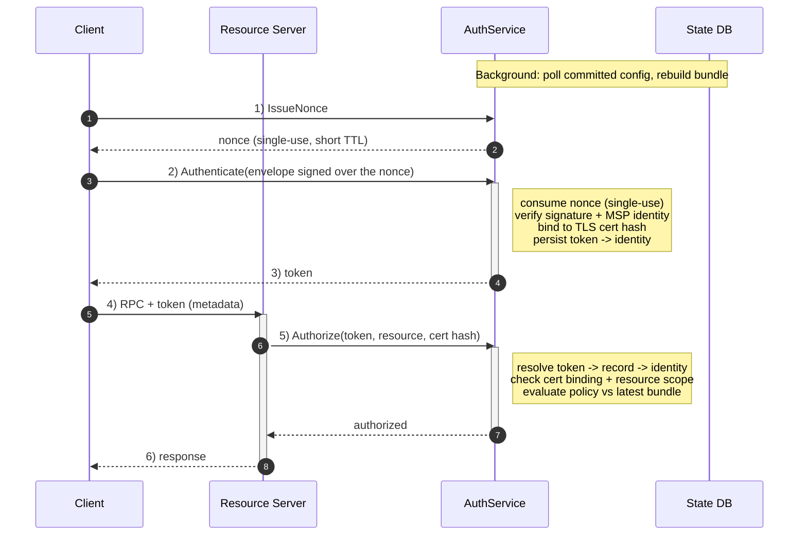

- Feature Name: committer_x_acl_enforcement
- Start Date: 2026-05-26
- Fabric-X Component: committer-x (query service, block query service, block deliver, notification service)
- Fabric-X Issue: https://github.com/hyperledger/fabric-x-committer/issues/592

# Summary
[summary]: #summary

This RFC proposes an Access Control List (ACL) enforcement layer for the gRPC APIs exposed by Committer-X,
built around a **dedicated, central Authentication & Authorization Service (`AuthService`)** that issues
**certificate-bound JSON Web Tokens (JWTs)**.

Every exposed RPC is a resource; every resource maps to a channel policy that decides which client identities
may invoke it. Policies and identities both come from the channel-configuration bundle — the single source of
truth — refreshed as new configuration blocks are committed. A hard-coded default resource-to-policy map is the
fallback for resources the channel configuration does not mention.

The design separates **authentication** — a full MSP signature verification, paid once — from **authorization**,
paid on every call but reduced to a token lookup and a policy evaluation:

1. The client asks the `AuthService` for a **single-use nonce**.
2. The client signs that nonce into a `common.Envelope` and presents it to `Authenticate`. The service verifies
   the signature, consumes the nonce, binds the identity to the client's TLS certificate, persists the
   token→identity record, and returns a JWT with a configurable TTL.
3. On every subsequent RPC the client attaches only the **JWT** in gRPC metadata.
4. The resource server forwards the token, the client's TLS certificate hash, and the resource name to
   `Authorize`. The `AuthService` resolves the identity, checks the binding and scope, evaluates the policy
   against the latest bundle, and answers. The RPC proceeds only on approval.

This avoids re-verifying a full signed envelope on every call, works behind client-side load balancing and
horizontal scale-out (authorization state lives in one place, not on a socket or an instance), and enables
**scoped tokens** for least privilege. The trade-off is operational: the `AuthService` becomes critical
infrastructure that must be highly available, monitored, and backed by persistent state.

**ACL enforcement is opt-in per service.** A resource service configured without an `auth:` section serves
exactly as it does today, with no interceptors installed and no dependency on the `AuthService`.

# Motivation
[motivation]: #motivation

Committer-X exposes its gRPC APIs with no authorization check. Any connection that completes the mTLS handshake
may invoke any method — transaction queries, block delivery and queries, notification streams — regardless of
which organization the client belongs to or what role the channel grants it.

Mutual TLS proves *who* a client is at the transport layer; it does not decide *what* that client may do.
Without an ACL layer the system cannot express that, say, only members of organization A may read blocks while
members of organization B may only subscribe to notifications.

An earlier direction bound the verified identity to the **gRPC connection** — authorize once, cache the identity
on the socket, reuse it. That does not survive a production topology: one `grpc.ClientConn` fans out across
many sockets (dual-stack DNS, Kubernetes, HA, scale-up) and a load-balancing policy spreads RPCs across them.
The socket that was authorized is not the socket carrying the next RPC, and under horizontal scaling the
instance that issued the identity is not the instance receiving the request. Making per-connection binding work
would require re-authenticating on every new socket.

A production-grade answer must make the decision available to *any* instance receiving *any* of a client's RPCs
without pinning the client to a socket or a process. A central `AuthService` holding the authoritative
token→identity state does exactly that.

The intended outcome: (1) every exposed method has an explicit resource name; (2) every resource has a policy
backed by the channel configuration; (3) decisions follow configuration updates automatically, including for
in-flight streams; (4) a default map covers resources not yet in the channel configuration; (5) authentication
is paid once per client and reused as a lightweight token; and (6) a captured authentication envelope cannot be
replayed.

# Guide-level explanation
[guide-level-explanation]: #guide-level-explanation

A resource is a gRPC full-method name, `/{proto-package}.{Service}/{Method}`. Each maps to a channel policy such
as `/Channel/Application/Readers`. Operators declare the mapping in `configtx.yaml`:

```yaml
ACLs:
  /committerpb.QueryService/GetTransactionStatus: /Channel/Application/Readers
  /committerpb.BlockQueryService/GetBlockByNumber: /Channel/Application/Readers
```

Resource servers hold **no signing keys and no MSP evaluation logic**. They shuttle a token and a resource name
to the `AuthService` and honour its answer. Two runtime components:

- **`AuthService`** — a standalone gRPC service that issues nonces, authenticates clients from a signed envelope
  and mints cert-bound JWTs, and authorizes `(token, resource, cert hash)` on behalf of resource
  servers. It holds the latest channel-configuration bundle and the persisted token→identity records.
- **ACL interceptors** — one unary and one streaming interceptor installed on each exposed service (Query and
  Sidecar services). They read the JWT from metadata and the caller's TLS certificate hash from the connection,
  ask the `AuthService`, and run the handler only on approval.

## The end-to-end flow



A failed check surfaces as the exact gRPC status the `AuthService` returned:

```
rpc error: code = PermissionDenied desc = ACL check failed for [/committerpb.QueryService/GetTransactionStatus]:
identity is not authorized by the resource policy
```

Unary RPCs are authorized once per call. Streams are authorized at establishment and re-checked while open (see
[Streaming authorization](#streaming-authorization)).

## Scoped tokens (least privilege)

Because authentication is decoupled from resource access, a client may request **less authority than its
identity would grant**. A token may carry a **resource scope**: a list of gRPC full-method names it may be used
for, matched exactly. An automated job that only reads rows can hold a token limited to
`/committerpb.QueryService/GetRows`, and the same token is refused on block delivery even though the identity's
channel policy would allow it.

A scope can only narrow: it is checked *in addition to* the channel policy, never instead of it. Requested
scopes are normalized (trimmed, de-duplicated, order preserved), and an empty scope means the token carries the
identity's full authority.

Resource scope applies uniformly, because every RPC has a method name. Combined with the per-resource policies in
`configtx.yaml`, it covers the least-privilege cases we have today: *which methods* a credential may call, and
*which organizations* may call a given method at all.

### Future work: namespace scoping

A namespace scope would mean "this token may only touch `ns2`", so a client entitled to many namespaces could
hold a weaker one good for a single namespace. It is **not part of this iteration**.

The problem is that most requests never mention a namespace, so there is nothing to check the scope against.
`GetRows` asks for particular namespaces, so a scope can simply be compared against what was asked for. But
`GetBlockByNumber` asks for a block, and a block holds whatever was committed in it - transactions from every
namespace on the channel. The request never mentions a namespace at all.

Nor can we answer such a request with part of a block. A block is a sealed unit: clients check that the block
they receive is exactly the one that was committed, so a block with some of its transactions taken out fails
that check and is rejected. A trimmed block is not a smaller answer to the same question; it is a different kind
of answer, and it would need its own contract to be meaningful.

That leaves refusing those calls outright. It works, but it makes one token mean two different things depending
on which method is used: filtered where namespaces are named, refused everywhere else.

To support this feature we needs a decision, per
method, about what a namespace even means for that method, and a default that refuses whenever the answer is
unclear, so that a newly added RPC is never quietly left unprotected.


# Reference-level explanation
[reference-level-explanation]: #reference-level-explanation

## Architecture

1. **`AuthService`** — a standalone gRPC service exposing three RPCs:
    - `IssueNonce() → nonce, expires_at`
    - `Authenticate(signed_envelope, requested_scope) → token, expires_at`
    - `Authorize(token, resource, tls_cert_hash) → authorized, token_expires_at`

   It maintains the latest `channelconfig.Bundle` (refreshed in the background), a persisted token-record store
   keyed by `jti`, a persisted nonce store, and the signing key used to mint and verify JWTs. Because only the
   `AuthService` verifies tokens, the key never leaves it.

   `Authorize` returns only a decision and the bound token's expiry. It deliberately does **not** return the
   resolved identity.

2. **ACL interceptors** on Query and Sidecar: read the token from metadata, read the TLS cert hash from
   the connection, call `Authorize`, map the answer to `OK` / `PermissionDenied` / `Unauthenticated` /
   `Unavailable`. They never inspect the request body.

3. **The state database** — the PostgreSQL/YugabyteDB the committer already uses. It holds the committed
   configuration transaction (from which the bundle is built), the token records, and the nonces.

## Replay protection: the nonce challenge

A timestamp freshness window bounds *how long* a captured envelope stays useful; it does not make replay
impossible. The nonce does.

`IssueNonce` returns 32 bytes value with a short TTL. The client places it in the envelope's
**`SignatureHeader.Nonce`** — Fabric's canonical nonce field, and part of the marshaled payload the signature
covers, so it cannot be substituted without invalidating the signature. `Authenticate` **consumes** the nonce.

Three consequences worth stating explicitly:

- Nonces live in the **shared database**, not in one instance's memory, because a client behind a load balancer
  has no guarantee its `IssueNonce` and `Authenticate` calls reach the same instance. Consumption is a single
  conditional delete (`WHERE nonce = $1 AND expires_at >= $2`), so it is atomic and expiry-checked even when two
  instances race on the same nonce: exactly one delete affects a row.
- The nonce is redeemed **before** signature verification, so a replayed envelope cannot make the service repeat
  the expensive identity extraction and evaluation work.
- Because redemption precedes verification, **a nonce is burned by any failed `Authenticate`**, including one
  that fails for a benign reason such as a clock skew or a malformed envelope. A client that gets an error must
  call `IssueNonce` again before retrying; retrying with the same envelope will always fail. Unredeemed nonces
  are swept on the same interval as expired tokens.

## The token

A JWT minted and verified only by the `AuthService`, certificate-bound in the style of RFC 8705: the
`cnf` claim carries the SHA-256 of the client's TLS certificate, so the token is useless to a caller
that cannot present the matching certificate.

```
{
  "iss": "committer-x-auth",
  "sub": "<mspID>",
  "jti": "<opaque token id>",                // key into the persisted record
  "iat": <unix seconds>,
  "exp": <unix seconds>,                     // short TTL, e.g. 5m
  "cnf": { "x5t#S256": "<base64url(sha256(client TLS cert))>" },
  "scope": ["/committerpb.QueryService/GetRows"],
  "seq":  <config sequence at issuance>
}
```

### Why token→identity, not token→permissions

The record stores the client's **MSP identity**, not a snapshot of what it was allowed to do. This is
deliberate and load-bearing: a permission list would freeze authority at issuance, whereas storing the identity
lets every `Authorize` re-resolve it against the *latest* bundle and re-evaluate the policy. A configuration
change — an organization removed, an MSP rotated, a certificate revoked — therefore takes effect on the next
authorization rather than at the next token refresh, for open streams as well as new calls.

Storing a resolved permission set instead would also turn every configuration change into a migration: the
service would have to walk every unexpired record and recompute it, across instances, before the new policy
could be trusted. Resolving from the identity on each call needs no such pass — a new bundle takes effect the
moment it is swapped in.

### Token lifetime and revocation

**A token cannot be revoked. It is valid until it expires.** `token-ttl` (default 5m) is the only control: it is
the longest a stolen token, or an identity that has lost its channel authority, stays usable. Shorten it if that
window is too wide.


## Authentication (`Authenticate`)

Steps 1–3 of the diagram. The envelope carries the client's serialized MSP signing identity, a signature over
the payload, and — in its `ChannelHeader` — a `Timestamp` and, under mTLS, a `TlsCertHash`. The handler:

1. **Scope.** The envelope must really be an authentication request for this channel: the expected header type,
   a matching channel id, and **no payload data**. These are *scoping* checks — they pin down what an
   authentication envelope is, so that something the client signed for another purpose cannot be handed in as
   one.
2. **Freshness.** `Timestamp` must fall within the configured window. Compared as signed bounds, not as an
   absolute difference, so a far-future timestamp cannot overflow the arithmetic and be accepted indefinitely.
3. **Nonce.** Consumed as described above; failure is `Unauthenticated`.
4. **Certificate binding.** Under mTLS the claimed `TlsCertHash` must equal the hash of the connection's
   certificate (`util.ExtractCertificateHashFromContext`). Without a client certificate the token is not
   certificate-bound — see [Mutual TLS](#mutual-tls-is-required).
5. **Identity.** Deserialized and **validated** against the bundle's `MSPManager()`, and the signature
   verified, proving possession of the private key.
6. **Mint and record.** A `jti` is generated, the JWT is signed over it, and the record is persisted under it -
   in that order, so a failure at either step leaves neither a usable token nor an orphan row.

The requested scope is an ordinary request field and is not covered by the envelope signature. This is safe
because a scope can only *narrow* authority: the worst outcome of tampering is a token weaker than the client
asked for, never stronger.

## Authorization (`Authorize`)

Steps 4–6. On the **resource server**, the interceptor reads the token from metadata and the certificate hash
from its own connection, then calls `Authorize` and maps the result.

On the **`AuthService`**, `Authorize`:

1. verifies the JWT signature, algorithm, issuer, and expiry;
2. loads the record by `jti` (unknown → `Unauthenticated`);
3. checks the certificate binding against the hash observed at the resource server, so a leaked token cannot be
   replayed from another connection;
4. checks the resource against the token's resource scope;
5. re-resolves the identity from the record against the **latest** bundle and validates it, so an identity whose
   certificate has been revoked or whose MSP has been rotated out fails here rather than relying on the policy's
   principal type to validate it implicitly;
6. resolves the policy (bundle `ACLs`, then the default map) and evaluates it with
   `policy.EvaluateIdentities([]msp.Identity{identity})`.

`Authorize` is intended for resource servers. A client that calls it directly learns only whether a token it
already holds would be permitted on a resource — the decision is a boolean returned to the caller and confers no
access, because the resource server derives the certificate hash from *its own* connection, not from anything
the client asserts.

## Streaming authorization
[streaming-authorization]: #streaming-authorization

A stream binds the **token** it was established with. On each receive and send the wrapper checks whether its
cached decision has lapsed and, if so, re-`Authorize`s with that token.

Binding the token rather than the identity alone is what makes **token expiry** observable to an open stream:
re-presenting the token forces the `AuthService` to resolve it to its record before evaluating policy, so a
lapsed token denies the stream exactly as a policy change does. An identity-only re-check would see neither.

A decision is reused until it lapses, which is `min(stream-revalidate-interval, token expiry)`:

| Situation | Behaviour |
|---|---|
| **Establishment** | Full `Authorize` round-trip. The decision and the token's expiry are cached on the session. |
| **Decision still valid** | No round-trip; the message proceeds. This is the common case, so `AuthService` latency stays off the data path — a check on *every* message would add a round-trip per block and per batch. |
| **Decision lapsed** | The next receive or send re-authorizes with the token. Expiry and policy changes are both caught here. |
| **Token expired** | Denied **locally**, with no round-trip: the bound token is known to be dead, so no outage can extend a stream past the life of the token that established it. |
| **`AuthService` briefly unreachable** | An established stream keeps serving and retries on a bounded interval rather than failing on a transient blip. The bound token's expiry still caps how long this can continue, so an outage cannot extend a stream past its token. |

### Stream lifetime is the token lifetime

A stream cannot outlive the token that established it, and **refreshing a token does not extend an open
stream**: gRPC metadata is fixed at stream establishment, so the wrapper re-presents the token it was given.
When that token expires the stream is denied on its next message with `Unauthenticated`.

Clients must therefore expect a stream to end roughly every `token-ttl` and reconnect with a fresh token,
resuming from their last processed position — `peer.Deliver` via its seek position, `StreamAllTransactions` from
the last received block number. Operators running long-lived subscriptions should raise `token-ttl`, accepting
the longer exposure window that implies, since TTL is also the only bound on a compromised token.

## Persistence & recovery
[persistence--recovery]: #persistence--recovery

If token→identity records lived only in memory, a restart or failover would invalidate every token and force all clients to re-authenticate. They are therefore **persisted in the state database**.

```go
type TokenRecord struct {
    JTI            string          // token id (row key)
    Identity       *msppb.Identity // MSP identity, re-resolved against the latest bundle
    MSPID          string
    CertHashSHA256 []byte          // cnf/x5t#S256 binding
    Scope          []string        // optional resource scope
    IssuedSequence uint64          // config sequence at issuance
    ExpiresAt      int64           // unix seconds, for TTL sweep
}
```

Two dedicated tables, `auth_tokens` and `auth_nonces`. Their schema is applied **once, by the `init-db`
command**, alongside the committer's other tables.

They deliberately do **not** follow the `ns_<id>` state-namespace scheme: this is auth infrastructure, not
committer world state, and conflating the two would expose it to namespace tooling and policy that does not
apply to it.

On startup the service warms an in-memory cache of unexpired records so recently issued tokens resolve without a
round-trip. A background sweep deletes lapsed rows and evicts them from the cache.

Since every instance reads the same rows, the design is stateless from the resource server's perspective and
horizontally scalable: any `AuthService` instance can authorize any token (if they have the same key).

## Bundle refresh

ACL evaluation needs MSP and policy definitions, which come from the channel-configuration bundle. The
`AuthService` reads it **from the state database**, reusing the mechanism the query service already uses: read
the configuration envelope from the config namespace (`applicationpb.ConfigTransaction{Envelope, Version}`) and
build a `channelconfig.Bundle` via `channelconfig.NewBundleFromEnvelope`. A background goroutine polls on a
configurable interval and atomically swaps the bundle **only when the version strictly advances**.

**A failed refresh does not fail closed.** The error is logged and retried on the next tick, and the service
keeps authorizing against the last bundle it loaded. This is a deliberate choice, and it matches the sidecar and
query service, whose TLS Root CAs refresh from the same table behaves the same way: it rests on the state database
being highly available, and it prefers continued availability over rejecting every RPC during a transient
database problem.
The consequence is that a prolonged database outage leaves policy stale.

## Bootstrap

Before any configuration block is committed there is no bundle to evaluate against. Bootstrap reuses the
genesis-block path: the sidecar receives the genesis block, it is committed, and the configuration transaction
lands in the config namespace; the background refresh then builds the first bundle.

Until then the `AuthService` returns `Unavailable` and ACL-protected methods reject calls. This is a small,
bounded delay in API availability between process start and first bundle. Since the first block is always the
configuration block, nothing useful is exposed before enforcement is active.

## Mutual TLS is required
[mutual-tls-is-required]: #mutual-tls-is-required

The certificate binding *is* the token's proof-of-possession property, and it follows entirely from the
transport: mutual TLS puts the client's certificate on the connection and the service binds to it.

Choosing anything other than `mtls` is choosing bearer tokens. This is an accepted mode, not a defect, but
it is a security decision that belongs to whoever writes the configuration. Under it, `token-ttl` is the only
thing bounding a captured token, which is a further reason to keep it short.

## Configuration

Default resource-to-policy mappings live in code. Operator-visible mappings live in `configtx.yaml` under
`ACLs`. Lookup order: the bundle's `ACLs` section, then the default map; if neither defines the resource, the
request is denied.

- **`AuthService`**: signing key path (shared across instances; an ephemeral key is generated when empty, which
  suits only a single-instance dev deployment), token TTL, envelope freshness window, nonce TTL, config-refresh
  interval, token-cleanup interval, and the database connection.
- **Resource services (Query, Sidecar)**: an optional `auth:` section carrying the `AuthService` endpoint and
  its TLS settings, plus an optional stream re-validation interval.

**Omitting `auth:` disables ACL enforcement for that service.** The section is an optional pointer with no
defaults, so an operator who leaves it out gets a service that installs no interceptors, opens no connection to
the `AuthService`, and behaves exactly as it does today.

# Prior art
[prior-art]: #prior-art

**OAuth 2.0.** The `AuthService` is the authorization server, the JWT the access token, Query and Sidecar the
resource servers: authenticate once centrally for a short-lived scoped token, then access resources many times
with it.

**RFC 8705 (Mutual-TLS Certificate-Bound Access Tokens).** The `cnf.x5t#S256` claim makes the token a
proof-of-possession credential, which is what makes it safe to carry in metadata instead of re-sending a signed
envelope. The nonce challenge closes the remaining replay window on the *authentication* step itself.

**RFC 7662 (Token Introspection).** The model in which a resource server consults an authorization server about
a token it cannot itself interpret. This design is that model: the resource server never inspects the token, and
the persisted record — not the token's contents — is authoritative.

**Hyperledger Fabric ACLs.** Fabric governs resources with hard-coded default mappings plus dynamic definitions
in the channel configuration, evaluating `SignedData` against a policy. Committer-X reuses the same policy
definitions (`Readers`/`Writers`/`Admins` as `ImplicitMeta` rules) from the bundle. The difference is *where and
how often* the identity is verified: Fabric verifies a signature on every call; this design verifies once at
`Authenticate` and thereafter evaluates the resolved identity carried by a cert-bound token.

# Alternatives considered
[alternatives]: #alternatives

- **Connection-bound identity.** Rejected: it requires re-authenticating on every socket a `grpc.ClientConn`
  opens, which the client cannot drive through that abstraction, and the authorized socket is not the one
  carrying the next RPC under client-side load balancing. See [Motivation](#motivation).
- **Signed envelope in metadata on every RPC.** A viable stateless alternative reusing the existing MSP path,
  with no new critical service — but it pays a full signature verification on *every* request and offers no
  scoped tokens. Should per-call verification cost prove negligible and operational simplicity dominate, this
  remains the natural fallback.
- **Folding authentication into an existing service** (e.g. the query service). Delayed: it remains
  a reasonable option and is open for discussion as future work. A standalone `AuthService` is the starting
  point because authenticating clients and serving data are separate responsibilities, and keeping them apart
  keeps both APIs clean.

# Dependencies
[dependencies]: #dependencies

- MSP, policy, and channel-configuration packages from `fabric-x-common` (`protoutil`, `msp`, `policies`,
  `channelconfig.NewBundleFromEnvelope`).
- `protoutil.EnvelopeAsSignedData`, `protoutil.MakeSignatureHeader`, and
  `util.ExtractCertificateHashFromContext` from `fabric-x-common`.
- A JWT library for ES256 minting/verification with `cnf`/`x5t#S256` and claims validation.
- A new `AuthService` proto (`IssueNonce`/`Authenticate`/`Authorize`) and a new service binary on the existing
  `serve` lifecycle.
- `sampleconfig/configtx.yaml` in `fabric-x-common` for a sample `ACLs` section.
