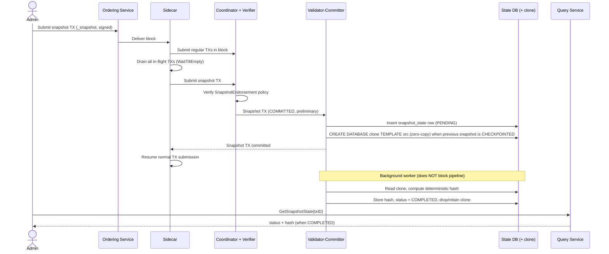
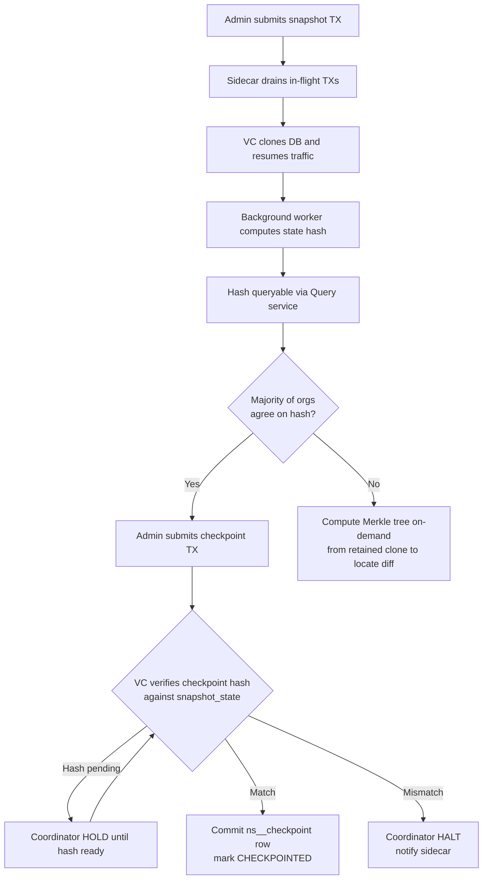

- Feature Name: database_snapshot_and_checkpoint
- Start Date: 2026-07-15
- RFC PR:
- Fabric-X Component: fabric-x-committer (sidecar, coordinator, verifier, validator-committer, query)
- Fabric-X Issue:

# Database Snapshot & Checkpoint

## Summary

This RFC introduces two special transaction types to the Fabric-X committer pipeline: a **snapshot transaction** that triggers a consistent, point-in-time snapshot of the entire state database, and a **checkpoint transaction** that records a cross-organization-attested snapshot hash after local verify-before-commit. When the sidecar receives a block containing a snapshot transaction, it drains all in-flight transactions before submitting the snapshot transaction to the coordinator, guaranteeing the snapshot reflects exactly the committed state up to that point. The validator-committer that processes the snapshot transaction captures the database via a **native zero-copy (copy-on-write) clone**, resumes normal processing, and deterministically computes a SHA-256 hash over the cloned state in a background worker. The hash is stored in a `snapshot_state` table and is queryable through the query service. Once a majority of organizations independently verify and agree on the hash, an administrator submits a checkpoint transaction. The VC verifies the checkpoint value against the local `snapshot_state.hash` before committing it to the `_checkpoint` namespace (backed by the `ns__checkpoint` table). Snapshot and checkpoint transactions are independently authorized by `SnapshotEndorsement` and `CheckpointEndorsement` policies defined in the channel configuration block.

## Motivation

Operators of a Fabric-X network periodically need a verifiable, consistent record of the entire ledger state — for audit, disaster recovery, cross-organization reconciliation, bootstrapping new nodes, and detecting silent state divergence between organizations. Today the committer offers no first-class mechanism to capture such a snapshot atomically while the pipeline is live, nor a way for organizations to attest collectively that they hold identical state at a given block height.

The expected outcomes are:

- **Consistent point-in-time capture.** A snapshot reflects exactly the set of transactions committed before the snapshot transaction, with no in-flight writes leaking in or being lost.
- **Non-disruptive operation.** Snapshot capture uses a zero-copy clone, so the disruptive window is only the clone-creation duration (seconds), not a full table scan. Hash computation runs in the background and never blocks transaction processing.
- **Cross-organization verification.** Because the hash is computed deterministically over sorted key-value pairs, every organization's committer produces the same hash for the same state. Mismatches reveal divergence and can be localized on-demand via a Merkle tree computed from the retained clone.
- **Durable attestation.** A checkpoint transaction provides a signed, on-ledger record that a majority of organizations agreed on the state hash at a block height.

Use cases include scheduled audits, regulatory attestation, fast node bootstrap from a known-good state, and forensic diff analysis when organizations disagree.

## Guide-level explanation

This section introduces the feature as a Fabric-X developer or operator would encounter it. We start with the high-level flow, then drill into concepts and concrete examples.

### High-level flow

At a high level, the feature adds two administrator-driven, policy-gated operations that ride through the **existing** committer pipeline (Sidecar → Coordinator → Verifier → Validator-Committer), plus a read path through the Query service.

**Taking a snapshot.** An authorized administrator submits a *snapshot transaction* to the ordering service. When it reaches the sidecar inside a block, the sidecar first lets every transaction that was ordered before it finish committing, so the snapshot captures a clean, consistent cut of the ledger — nothing in-flight leaks in, nothing already committed is missed. The sidecar then hands the snapshot transaction to the pipeline. The validator-committer that processes it takes a near-instant, zero-copy clone of the state database and immediately lets normal traffic resume. A background worker then walks the clone and computes a deterministic hash of the entire state. Because the hash is computed the same way by every organization, two organizations holding identical state will compute identical hashes.

**Agreeing on the state.** Each organization fetches its computed hash for the agreed block height (through the Query service) and compares with the others, off-ledger. This comparison is a human/operational step — the network does not force it.

**Recording agreement.** Once a majority of organizations agree on the hash, an administrator submits a *checkpoint transaction* carrying the agreed snapshot `TxHeight` and hash. It flows through the same pipeline (no draining needed — it is a normal write to a system namespace), but the validator-committer verifies the checkpoint value against the local `snapshot_state.hash` before commit. On match, it records the checkpoint durably in the `ns__checkpoint` table as an on-ledger attestation; on pending hash it holds via the coordinator; on mismatch it halts via the coordinator and sidecar. If hashes ever disagree, the retained clone can be used to compute a Merkle tree on-demand and pinpoint exactly where the divergence is.

The two operations are independent: snapshotting and hashing work entirely on their own; checkpointing is the optional, cross-organization attestation layer on top.

The snapshot sequence — from submission, through draining, to background hashing — looks like this:



The overall lifecycle — snapshot, cross-organization comparison, then checkpoint — is summarized below:



> Note: these diagrams are written in Mermaid. They render on GitHub and in Mermaid-aware viewers; in the generated Word document they appear as a fenced code block describing the same flow.

### New concepts

- **Snapshot transaction** — A transaction in the reserved `_snapshot` namespace (using `HeaderType_MESSAGE`, like a regular transaction). It carries no blind writes; the namespace alone signals "take a snapshot." It must be signed to satisfy the `SnapshotEndorsement` policy.
- **Checkpoint transaction** — A transaction in the reserved `_checkpoint` namespace. It carries a single **versioned write** (a `ReadWrite`, not a blind write): key = the snapshot's **transaction height** (`TxHeight` — block number + transaction number) serialized via the existing `servicepb.Height.ToBytes()` order-preserving varint encoding, value = the agreed snapshot hash, version = usually nil (a new key at that `TxHeight`, so MVCC resolves it as version 0). A versioned write (rather than a blind write) subjects the checkpoint to MVCC validation, so two conflicting checkpoints at the same key cannot both commit. The committed row lands in the `ns__checkpoint` table (the table backing the `_checkpoint` namespace). It must satisfy the `CheckpointEndorsement` policy. The key is a full `TxHeight`, not just the block number, because the sidecar splits the block containing a snapshot transaction into two batches (regular transactions, then the snapshot transaction); the snapshot transaction therefore shares its block number with the preceding regular transactions, so block number alone cannot uniquely identify the snapshot commit point — the `(block_number, tx_number)` pair (the snapshot's `TxHeight`) is the unambiguous marker.
- **`SnapshotEndorsement` / `CheckpointEndorsement` policies** — Two independent channel policies defined in the config block, resolved exactly like the existing `LifecycleEndorsement` policy. Snapshot and checkpoint transactions have different operational impact: a snapshot triggers the sidecar drain plus clone/hash workflow, while a checkpoint records agreement only after local verify-before-commit and may hold/halt the pipeline if the hash is pending or mismatched. Operators configure their thresholds independently.
- **`snapshot_state` table** — A new VC table that tracks each snapshot's lifecycle: `PENDING → IN_PROGRESS → COMPLETED → CHECKPOINTED` (or `FAILED` while retrying), keyed by `tx_id`, with the computed hash and the name of the backing clone database. Every snapshot request is accepted (there is no rejection of concurrent requests); snapshots are hashed strictly in `TxHeight` order, and the next snapshot's hash is computed only after the previous snapshot is `COMPLETED` **and** `CHECKPOINTED`.
- **Snapshot clone** — A native zero-copy database clone created by `CREATE DATABASE ... TEMPLATE ...`. It is the snapshot's content. It is retained for `snapshot_retention_days` (or until manually deleted) so a Merkle tree can be computed on-demand if hashes diverge.

### Walking through a snapshot

An administrator constructs and signs a snapshot transaction and submits it to the ordering service:

```go
tx := &applicationpb.Tx{
    Namespaces: []*applicationpb.TxNamespace{{
        NsId:      committerpb.SnapshotNamespaceID, // "_snapshot"
        NsVersion: 0,
        // No blind writes — the _snapshot namespace alone signals the request.
    }},
    Endorsements: []*applicationpb.Endorsements{{
        EndorsementsWithIdentity: []*applicationpb.EndorsementWithIdentity{
            // Signatures satisfying the SnapshotEndorsement policy.
        },
    }},
}
```

When the sidecar receives the block, it transparently:

1. Splits the block into regular transactions and the snapshot transaction.
2. Submits the regular transactions, then drains all in-flight work (`waitingTxsSlots.WaitTillEmpty`) — the same mechanism used for config blocks.
3. Submits the snapshot transaction.
4. Waits for the snapshot transaction to commit, then resumes normal submission.

The developer does **not** write any drain logic — it is automatic, triggered by the `_snapshot` namespace.

### Observing progress

Snapshot transaction status (committed/aborted) arrives via the existing notification service, exactly like any other transaction. The longer-running hash computation is observed via a pull-based query:

```go
state, err := queryClient.GetSnapshotState(ctx, &committerpb.SnapshotQuery{TxId: snapshotTxID})
// state.Status: PENDING, IN_PROGRESS, COMPLETED, CHECKPOINTED, or FAILED
// state.Hash:   populated when status is COMPLETED or CHECKPOINTED
```

### Reaching agreement and checkpointing

Each organization retrieves the hash at the agreed snapshot point and compares offline. If they match, an administrator submits a checkpoint transaction recording the agreed hash keyed by the snapshot's `TxHeight` (block number + tx number); if they differ, the retained clone is used to compute a Merkle tree on-demand to locate the divergence.

```go
tx := &applicationpb.Tx{
    Namespaces: []*applicationpb.TxNamespace{{
        NsId:      committerpb.CheckpointNamespaceID, // "_checkpoint"
        NsVersion: 0,
        ReadWrites: []*applicationpb.ReadWrite{{
            // Full TxHeight of the snapshot point (block number + tx number),
            // not just block height — the snapshot TX shares its block number
            // with the regular TXs it was split from. A versioned (non-blind)
            // write is used so the checkpoint is MVCC-validated.
            Key:     servicepb.NewHeight(snapshotBlockNum, snapshotTxNum).ToBytes(),
            Version: nil, // usually nil (new key at this TxHeight); MVCC-validated by the VC
            Value:   agreedHashBytes,
        }},
    }},
    // Endorsements satisfying CheckpointEndorsement policy.
}
```

### Error messages and edge behavior a developer will see

- **Insufficient signatures** → the transaction is aborted with `ABORTED_SIGNATURE_INVALID` at the verifier, before it reaches the VC.
- **Multiple snapshot requests** → all are accepted; each creates a `snapshot_state` row. Hashes are computed strictly in `TxHeight` order, one at a time — the next snapshot's hash begins only after the previous snapshot is `COMPLETED` and `CHECKPOINTED`. There is no rejection of concurrent requests.
- **A duplicate snapshot (same `tx_id`)** → ignored idempotently (primary-key conflict), no error.
- **The corresponding checkpoint commits (hash present, matches)** → the VC verifies the checkpoint's hash against the local `snapshot_state` row for that `TxHeight`, commits the `ns__checkpoint` write, and marks the row `CHECKPOINTED` — which unblocks the next snapshot's hash computation.
- **The checkpoint's hash is not yet computed** → the checkpoint **waits** until the hash exists, then verifies. The VC signals the coordinator to hold; the coordinator pauses processing (and notifies the sidecar) until the hash lands. This is a bounded stall (bounded by hash-compute time), accepted as the price of deterministic verify-before-commit.
- **Checkpoint hash mismatches the local snapshot** → the VC signals the coordinator, which **halts** processing and notifies the sidecar to stop submitting; all commits stall. This is a serious integrity condition requiring operator intervention (local state diverged from the org-attested snapshot).

### Impact on established vs. new developers

Established developers should note that snapshot/checkpoint transactions reuse the existing envelope type and pipeline — there is no new `HeaderType`, no new delivery path, and no new coordination protocol. The only genuinely new infrastructure is the `snapshot_state` table, the background hash worker in the VC, and a small set of gRPC RPCs. New developers can treat snapshot/checkpoint as "system namespaces handled like `_meta` / `_config`."

### Security and administration impact

- Both transaction types are gated by channel policies, so only authorized administrators can trigger a (disruptive) snapshot or record a checkpoint.
- On PostgreSQL, clone creation briefly terminates all connections to the source database cluster-wide; services reconnect via the existing backoff. Operators should be aware of this brief, bounded disruption window. YugabyteDB clones cause no disconnection.
- The query service remains read-only; all mutating operations (clone deletion) flow through the sidecar and the normal pipeline.

## Reference-level explanation

This section returns to the examples above and details how the design is implemented across the pipeline. Changes touch four services (sidecar, verifier, VC, query), one new proto file in `fabric-x-common`, and one new DB table.

### Transaction identification

Snapshot and checkpoint transactions use `HeaderType_MESSAGE` (the same envelope type as regular transactions), distinguished by reserved namespace IDs `_snapshot` and `_checkpoint`. This mirrors how config transactions use namespace `_config`. No new `HeaderType` is introduced — adding one would require coordinated changes to `fabric-x-common` and `fabric-protos-go-apiv2` with a large blast radius.

The namespace IDs are added as exported constants in `committerpb` (in `fabric-x-common`), alongside `MetaNamespaceID` / `ConfigNamespaceID` — e.g. `committerpb.SnapshotNamespaceID = "_snapshot"` and `committerpb.CheckpointNamespaceID = "_checkpoint"`. Code references the constants rather than string literals. The verifier's namespace-policy validation must also reserve these IDs so administrators cannot create ordinary application namespace policies for `_snapshot` or `_checkpoint` in `ns__meta`.

### Sidecar: detection and drain

- **`mapping.go`** — In `mapMessage`, after unmarshalling the `applicationpb.Tx` for a `HeaderType_MESSAGE` envelope, the sidecar inspects the namespaces. A `_snapshot` namespace sets a flag on the block mapping result. Current form checks reject ordinary namespaces with no writes (`MALFORMED_NO_WRITES`); add a targeted exception for marker-only `_snapshot` transactions while preserving that rejection for application namespaces.
- **`relay.go`** — When a block contains both regular transactions and a snapshot transaction, the block is split: regular transactions are submitted as the first batch, drained via the existing `waitingTxsSlots.WaitTillEmpty`, and then the snapshot transaction is submitted as a separate batch. After the snapshot transaction completes, the sidecar drains again before resuming normal submission. This reuses the exact mechanism already used for config blocks, so the ordering invariant (snapshot sees all prior writes, nothing newer) requires no new coordination primitive.
- A dedicated `isCheckpoint` flag is **not** required: checkpoint transactions need no drain and flow through the pipeline like regular transactions; the `_checkpoint` namespace is sufficient for downstream recognition.

### Coordinator

The coordinator dispatches snapshot and checkpoint transactions through the dependency graph like regular transactions (the snapshot TX has no reads or writes; the checkpoint TX carries a single `ReadWrite` on the `_checkpoint` key), but treats `_snapshot` and `_checkpoint` as system namespaces for dependency construction. Current dependency construction adds a `_meta` namespace-version read for every non-`_meta`/non-`_config` namespace; extend that exemption so `_snapshot` and `_checkpoint` do not depend on ordinary namespace-policy rows in `ns__meta`. The sidecar drain plus the coordinator's batch-ordering guarantee ensures the snapshot observes all prior writes.

The coordinator gains one new responsibility: **handling checkpoint verification feedback from the VC.** When a VC processing a checkpoint TX finds that (a) the referenced snapshot's hash is **not yet computed**, or (b) the hash **mismatches** the checkpoint value, it returns feedback to the coordinator rather than committing. The coordinator then:

- **hash-not-ready** → **holds** (pauses) processing of that checkpoint until the VC signals the hash is available and verified, then resumes. This is a bounded pause (bounded by hash-compute time).
- **hash-mismatch** → **halts** processing and notifies the **sidecar** to stop submitting new transactions. This is a serious integrity condition requiring operator intervention.

Routing the wait/halt through the coordinator (and on to the sidecar) keeps the control decision at the pipeline level, so no cross-VC coordination is needed even though state is sharded across multiple VC instances.

### Verifier: authorization

Both policies are extracted from the config block in `createVerifiers`, mirroring `ParseLifecycleEndorsementPolicy`:

```go
if update.Config != nil {
    nsVerifier, err := policy.ParseLifecycleEndorsementPolicy(bundle)
    newPolicies[committerpb.MetaNamespaceID] = nsVerifier

    snapshotVerifier, err := policy.ParseSnapshotPolicy(bundle)
    newPolicies[committerpb.SnapshotNamespaceID] = snapshotVerifier

    checkpointVerifier, err := policy.ParseCheckpointPolicy(bundle)
    newPolicies[committerpb.CheckpointNamespaceID] = checkpointVerifier
}
```

`ParseSnapshotPolicy` and `ParseCheckpointPolicy` resolve channel policies by path — `/Channel/Application/SnapshotEndorsement` and `/Channel/Application/CheckpointEndorsement` — via `bundle.PolicyManager().GetPolicy(path)`, then wrap them with `signature.NewNsVerifierFromChannelPolicy(p)`. Crucially, these use the **same policy DSL as `LifecycleEndorsement`**: a Fabric channel policy expressed as an ImplicitMeta rule (e.g. `MAJORITY Endorsement`, `ALL Admins`) or an explicit Signature/MSP rule, evaluated through the MSP. There is **no** new policy proto; the `ThresholdRule`/key-based path in `applicationpb.NamespacePolicy` is reserved for user-namespace `_meta` policies and is not used here.

`verifyRequest` performs an exact-key lookup `verifiers[ns.NsId]`, so two independent verifier instances registered under `_snapshot` and `_checkpoint` give clean, alias-free dispatch. A missing policy or a failing evaluation yields `ABORTED_SIGNATURE_INVALID`. `validateNamespaceIDInPolicy` must reject `_snapshot` and `_checkpoint` (in addition to `_meta` and `_config`) so these system namespaces cannot be overridden by user namespace policies in `ns__meta`.

### Validator-committer: snapshot capture

The snapshot content is captured by a **native, zero-copy (copy-on-write) database clone**, not by copying rows into a table.

| | YugabyteDB | PostgreSQL (18+) |
|---|---|---|
| Command | `CREATE DATABASE clone TEMPLATE src AS OF <unix_micros>` | `CREATE DATABASE clone TEMPLATE src STRATEGY=FILE_COPY` |
| Mechanism | DocDB distributed snapshot; COW on divergence | Filesystem reflink (`FICLONE`) via `file_copy_method=clone` |
| Point-in-time | Yes (`AS OF`, within snapshot-schedule retention) | No — current state only |
| Source connections | Stay live — no termination | **Must be terminated** for the clone duration |
| Prerequisites | `enable_db_clone=true` + snapshot schedule | `file_copy_method=clone` + reflink FS (XFS/ZFS/Btrfs/APFS) |
| Maturity | EARLY ACCESS | GA (PG18) |

On PostgreSQL, the VC performing the clone uses a dedicated admin connection held **outside** its pgxpool, and a race-free sequence:

1. `ALTER DATABASE src ALLOW_CONNECTIONS false` — reject new connections (closes the reconnect race).
2. `SELECT pg_terminate_backend(pid) FROM pg_stat_activity WHERE datname = 'src'` — kill remaining sessions.
3. `CREATE DATABASE clone TEMPLATE src STRATEGY=FILE_COPY`.
4. `ALTER DATABASE src ALLOW_CONNECTIONS true` — re-enable.

All VC and query instances share one DB cluster, so a single clone is a globally consistent cut. Disconnected instances reconnect via the existing `retry.Profile` backoff; since the lockout lasts only the clone duration, backoff alone bounds the reconnect storm — no new shared gate is needed. On YugabyteDB no connections are dropped.

Without a reflink-capable filesystem, PostgreSQL `FILE_COPY` performs a physical byte-for-byte copy — still consistent and usable, just not zero-copy.

### Validator-committer: `snapshot_state` table and crash recovery

A new table tracks the lifecycle of each snapshot:

| Column | Type | Constraints | Description |
|---|---|---|---|
| `tx_id` | `TEXT` | `PRIMARY KEY` | Snapshot transaction ID (client-facing key) |
| `block_height` | `BIGINT` | `NOT NULL` | Block number at which the snapshot was taken (from `TxRef.BlockNum`) |
| `tx_num` | `INTEGER` | `NOT NULL` | Transaction number of the snapshot TX within its block (from `TxRef.TxNum`); together with `block_height` forms the snapshot's `TxHeight` marker |
| `hash` | `BYTEA` | | Computed SHA-256 hash; NULL until `COMPLETED` |
| `status` | `INTEGER` | `NOT NULL, DEFAULT 1` | 1=PENDING, 2=IN_PROGRESS, 3=COMPLETED, 4=FAILED (transient, retrying), 5=CHECKPOINTED |
| `created_at` | `TIMESTAMP` | `NOT NULL, DEFAULT NOW()` | Row creation time |
| `updated_at` | `TIMESTAMP` | `NOT NULL, DEFAULT NOW()` | Last update time |
| `checkpointed_at` | `TIMESTAMP` | | When the corresponding checkpoint TX committed (hash verified); NULL until then |
| `clone_deleted_at` | `TIMESTAMP` | | When the clone was dropped; NULL while retained |
| `clone_db_name` | `TEXT` | | Name of the backing clone DB; authoritative reference for `DROP DATABASE`. NULL until the clone is created |
| `error` | `TEXT` | | Error message when `FAILED`, or when the committer halted on a permanent hash failure or a checkpoint mismatch |

The `(block_height, tx_num)` pair carries a `UNIQUE` constraint (the snapshot's `TxHeight`); block number alone is **not** unique because the sidecar splits the block containing a snapshot transaction into two batches, so a snapshot transaction and the regular transactions it was split from share the same block number.

The status integers are aligned with the `SnapshotState.Status` proto enum, allowing a direct cast without a mapping function.

**Ordering, not gating.** Every snapshot request is accepted (no `REJECTED`). Snapshots are hashed strictly in `TxHeight` order by the single background worker: the next snapshot's hash computation begins only after the previous snapshot is `COMPLETED` **and** `CHECKPOINTED`. This serialization is deterministic across committers (it depends only on committed order and committed checkpoint TXs), so every committer processes the same snapshot next. A transient `FAILED` (mid-hash error, crash) is retried and does not advance the order. A **permanent** hash failure (non-recoverable: state corruption, aged-out `AS OF` window, missing reflink FS) is a serious integrity condition — the committer signals the coordinator to **halt** for operator intervention, the same as a checkpoint mismatch; it is never masked by a local status transition.

**Recovery sequence.** Before issuing `CREATE DATABASE`, the VC inserts a `PENDING` row (recording `block_height`, `tx_num`, snapshot timestamp, and the chosen `clone_db_name`). The status is not advanced beyond `PENDING` until the clone succeeds and hashing begins. On clone failure or VC crash, the row stays `PENDING`; the coordinator resubmits the snapshot transaction, the VC finds the existing `PENDING` entry, runs `DROP DATABASE IF EXISTS <clone_db_name>` to clean any partial clone, and re-clones. On VC restart, rows in `PENDING`/`IN_PROGRESS`/`FAILED` are re-enqueued; `CHECKPOINTED` is terminal and is not. A non-recoverable hash failure halts the committer rather than transitioning to a terminal status. YugabyteDB recovery is bounded by the snapshot-schedule retention window (the persisted `AS OF` timestamp must still be valid).

### Validator-committer: deterministic hash computation

A single background goroutine (sequential channel worker) connects to the clone DB and computes the hash with no in-memory buffering beyond one row:

- For each namespace table in sorted `namespace_id` order, read rows sorted by key and hash incrementally with length-prefixed encoding: `len(key) || key || len(value) || value`, producing a per-namespace SHA-256.
- Combine per-namespace hashes into a final SHA-256 over `len(ns_id) || ns_id || ns_hash` tuples in sorted `namespace_id` order.
- The `tx_status`, `ns__meta`, and `ns__config` tables **are included** in the hash: their contents affect transaction processing (e.g. `tx_status` determines duplicate-`tx_id` rejection, `ns__meta` carries namespace versions, `ns__config` carries channel policies), so two organizations that processed the same transactions must agree on them. Only the following are excluded: `metadata` (holds the local, non-deterministic "last committed block number"), `snapshot_state` (local snapshot bookkeeping that differs per organization), and `ns__checkpoint` (attestations *about* state, not state itself — excluded to avoid a self-referential hash where each checkpoint changes the hash it attests to).

Length prefixing prevents collisions (e.g. `key="ab",value="cd"` vs `key="abc",value="d"`). A flat hash — not a Merkle tree — is used during normal operation because checkpoint agreement only needs the root hash; a Merkle tree is computed on-demand from the retained clone only when organizations disagree, to localize the diff. Per-namespace hashing is naturally parallelizable later without changing the protocol, since the combine step is already deterministic.

After success the hash is stored and the clone is dropped (unless retained per `snapshot_retention_days`); on failure the row becomes `FAILED` and is retried on restart.

### Validator-committer: checkpoint handling

The preparer recognizes `_snapshot` and `_checkpoint` as system namespaces. It skips the normal application namespace-version read against `_meta` for both. `_snapshot` has no reads or writes and is routed to snapshot handling; `_checkpoint` keeps its single versioned `ReadWrite`, but the committer verifies it against `snapshot_state` before letting the normal namespace-write path persist it. The committer:

1. Extracts the snapshot hash from the versioned-write value.
2. Decodes the versioned-write key (via `servicepb.NewHeightFromBytes`) as the snapshot's `TxHeight` — the `(block_number, tx_number)` pair identifying the snapshot commit point.
3. Looks up the local `snapshot_state` row for that `TxHeight` and **verifies before committing**. Because every committer accepted the snapshot TX in the ordered stream, every committer has a row for it — only its hash may not be ready yet:
   - **Hash present, matches** the checkpoint value → proceed (step 4).
   - **Hash present, mismatches** → the VC returns a **mismatch** signal to the coordinator instead of committing. The coordinator **halts** processing and notifies the sidecar to stop submitting; all commits stall. This is a serious integrity condition (local state diverged from the org-attested snapshot) requiring operator intervention. The divergence (local hash, checkpoint hash, `TxHeight`) is recorded.
   - **Hash not yet computed** (row still `PENDING`/`IN_PROGRESS`) → the VC returns a **hold** signal to the coordinator, which pauses processing of the checkpoint (and notifies the sidecar) until the hash for that `TxHeight` is computed; the VC then verifies as above. This is a bounded stall (bounded by hash-compute time). Verification is mandatory — the checkpoint is never committed without matching the local hash, and the wait never resolves to a false mismatch.
4. On a verified match, commits the versioned write to the `ns__checkpoint` table (the table backing the `_checkpoint` namespace, following the same `ns_<id>` convention as `ns__meta` / `ns__config`) via the normal namespace-write commit path: key = the snapshot's `TxHeight` bytes, value = the agreed snapshot hash bytes. The checkpoint is therefore an ordinary committed row in `ns__checkpoint`, not a bespoke write to the `metadata` table. Because the key is the full `TxHeight`, the table can retain multiple checkpoints; the version on the write is usually nil (a new key at that `TxHeight`), so MVCC resolves it as version 0.
5. Marks the local `snapshot_state` row `CHECKPOINTED` and sets `checkpointed_at = NOW()`. This unblocks the next snapshot's hash computation (snapshots are hashed in `TxHeight` order, one checkpoint at a time).

> **Recovery from divergence (future work).** When the committer halts on a hash mismatch, the intended recovery is to reset the diverged committer to the majority-attested state: roll back local state to `TxHeight` and restore from a peer committer's retained clone whose hash equals the checkpoint hash, then replay subsequent blocks. This depends on *bootstrap-from-clone* and *rollback-to-a-block* capabilities that are out of scope for this RFC (see Unresolved questions / Out of scope), so for now the committer halts and records the divergence for manual intervention.

The checkpoint value is thus always verified against the local `snapshot_state` hash before the checkpoint commits, waiting for the hash if necessary. It also corrects an earlier assumption that block height alone was a sufficient marker — because the sidecar splits the snapshot's block, the snapshot's full `TxHeight` (block number + tx number) is required to identify the snapshot point unambiguously.

### Proto and RPC surface

A new `snapshot.proto` in `fabric-x-common/api/committerpb/` defines `SnapshotState`, `SnapshotQuery`, `SnapshotListQuery`, `SnapshotListResponse`, and `DeleteDBCloneForSnapshotRequest`. A `CheckpointValue` proto is **not** required: the checkpoint is stored as an ordinary `ns__checkpoint` row (key = `TxHeight` bytes, value = hash bytes), which is self-describing. New RPCs:

- **QueryService (read-only):** `GetSnapshotState(SnapshotQuery) returns (SnapshotState)` and `ListSnapshots(SnapshotListQuery) returns (SnapshotListResponse)` read the `snapshot_state` table directly; `GetCheckpoint(...)` reads the `ns__checkpoint` table (returning the stored `TxHeight` + hash rows). All read paths live on the query service, including checkpoint retrieval — the checkpoint now lives in an ordinary namespace table (`ns__checkpoint`) that the query service's DB view can read, so there is no longer any reason to route it through the sidecar.
- **Unified SidecarService (mutation only):** `DeleteDBCloneForSnapshot(...) returns (Empty)` — propagates through the pipeline (sidecar → coordinator → VC) where the VC drops the clone by its stored `clone_db_name` and sets `clone_deleted_at`. This is the only snapshot/checkpoint RPC on the sidecar, because it is a write; keeping it off the query service preserves the query service's read-only contract.

Mutations are deliberately kept on the sidecar (and off the query service) to preserve the query service's read-only contract; all reads — snapshot state and checkpoint — live on the query service. All proto changes require `make proto`.

### Configuration

```yaml
vc:
  snapshot:
    retention_days: 30  # Auto-drop clone DBs older than N days (0 = no auto-drop)
```

Retention is VC-only (the sidecar does not own the DB). A background VC goroutine periodically drops clones older than the retention window and records `clone_deleted_at`; the `snapshot_state` row is retained for history.

## Drawbacks

- **PostgreSQL connection disruption.** On PostgreSQL, clone creation terminates all connections to the source cluster-wide for the clone duration. Although brief and bounded by backoff, this is a real (if short) availability blip for every VC and query instance. YugabyteDB avoids this, but on YugabyteDB the clone feature is EARLY ACCESS.
- **Environment prerequisites.** Zero-copy cloning requires either YugabyteDB with `enable_db_clone=true` plus a snapshot schedule, or PostgreSQL 18+ on a reflink-capable filesystem. Managed cloud databases (RDS, Cloud SQL) typically cannot provide reflink filesystem access, falling back to a slower physical copy.
- **Serialized snapshot hashing.** All snapshot requests are accepted, but hashes are computed strictly in `TxHeight` order, one at a time — the next snapshot's hash begins only after the previous is `COMPLETED` and `CHECKPOINTED`. This bounds throughput of snapshot operations: a snapshot whose checkpoint is slow (or never arrives) delays hashing of all later snapshots. It keeps processing deterministic across committers.
- **Bounded checkpoint stall.** A checkpoint TX verifies its hash against the local `snapshot_state` before committing; if the hash is not yet computed, the checkpoint (and the transactions behind it) wait until the hash is ready. This is a bounded, deterministic pause coordinated via the coordinator, accepted as the cost of verify-before-commit. A hash mismatch halts the pipeline for operator intervention.
- **Storage for retained clones.** Retaining clones for diff analysis consumes storage that grows with divergence from the source; misconfigured retention could accumulate clones.
- **New stateful surface.** The `snapshot_state` table, the background hash worker, and the recovery logic add operational surface area that must be monitored.
- **Cross-repo proto dependency.** `snapshot.proto` and the new namespace constants live in `fabric-x-common`, coupling this feature's release to a `fabric-x-common` change.

## Rationale and alternatives

**Why this design is preferred.** It threads snapshot/checkpoint through the existing pipeline with minimal new infrastructure: no new `HeaderType`, no new delivery path, no new coordination protocol, and concrete types throughout (consistent with the repo's simplicity-over-cleverness principle). The zero-copy clone eliminates data-copy I/O and isolates hashing from the live workload, so the only disruptive window is clone creation. Reusing `waitingTxsSlots.WaitTillEmpty` for the drain reuses a proven mechanism. Resolving policies via the existing channel `PolicyManager` reuses the `LifecycleEndorsement` machinery verbatim.

**Alternatives considered.**

- **`snapshot_data` table populated by a serializable transaction.** Streams all rows into a table (or hashes directly inside the transaction). Rejected: it pins the MVCC horizon for the full hash duration (vacuum bloat) and is **not crash-recoverable** — the snapshot dies with the transaction.
- **Server-side SQL hash aggregate (`pgcrypto`/custom aggregate).** Fastest, but requires extension support that is immature on YugabyteDB, and a mid-hash failure loses all progress.
- **`pg_dump` / `ysql_dump` subprocess.** Requires OS process management and filesystem access; not container-friendly.
- **New `HeaderType_SNAPSHOT`.** High blast radius across `fabric-x-common` and `fabric-protos-go-apiv2`.
- **Single shared `SnapshotCheckpoint` policy.** Simpler config but cannot set different thresholds for the high-impact snapshot versus the low-impact checkpoint.
- **`_snapshot_checkpoint` entry in `ns__meta` with verifier aliasing.** Requires a namespace-redirect mechanism that does not exist and has no other use case.
- **Merkle tree during normal operation.** Adds construction/serialization complexity for a capability only needed on disagreement; deferred to on-demand computation from the retained clone.

**Impact of not doing this.** Operators have no first-class, consistent, verifiable state snapshot, no cross-organization state attestation, and must resort to ad-hoc, error-prone external tooling that cannot guarantee a consistent cut against a live pipeline.

## Prior art

- **Hyperledger Fabric peer snapshots.** Fabric (classic) supports channel snapshots of the state database for bootstrapping peers without replaying the full chain. The committer's design borrows the spirit (snapshot for bootstrap/attestation) while adapting to its disaggregated pipeline and a single shared state DB.
- **Database-native cloning.** YugabyteDB instant database clone (`CREATE DATABASE ... AS OF`) and PostgreSQL 18 `STRATEGY=FILE_COPY` with reflink are the enabling primitives; both are documented, vendor-supported features. Their maturity differs (YugabyteDB EARLY ACCESS vs. PostgreSQL GA), which this design accommodates with per-DB code paths and a physical-copy fallback.
- **Merkle-tree state commitments.** Many ledgers (Ethereum, Cosmos/IAVL) use Merkle trees as the primary state commitment. Fabric-X intentionally diverges: a flat deterministic hash suffices for cross-org agreement, and a Merkle tree is computed on-demand only to localize a detected diff. This keeps the common path simple while preserving the diagnostic capability.
- **Deterministic state hashing.** Length-prefixed, sorted key-value hashing is a well-established technique for collision-resistant, reproducible digests across independent implementations.

## Testing

Beyond mandatory unit tests (table-driven, `t.Parallel()`, `require.Eventually` over `time.Sleep`):

- **Sidecar drain/split (unit + integration).** A block mixing regular transactions and a snapshot transaction must submit regular transactions first, drain, then submit the snapshot; no new transactions are submitted until the snapshot completes. Verify ordering and that the snapshot sees exactly prior writes (`make test-no-db`, then integration).
- **Verifier policy (unit).** Snapshot/checkpoint transactions with sufficient vs. insufficient signatures yield `COMMITTED` vs. `ABORTED_SIGNATURE_INVALID`; missing policy yields rejection. Exercise both ImplicitMeta and explicit MSP rules.
- **VC clone + hash (DB tests, `make test-all-db`).** On PostgreSQL: clone creation with connection termination, reconnection via backoff, deterministic hash over a seeded dataset, and clone drop. Verify the same dataset produces an identical hash across independent runs (cross-org determinism, SC-005).
- **Crash recovery (DB/integration).** Kill the VC mid-clone and mid-hash; on restart, verify `PENDING`/`IN_PROGRESS`/`FAILED` rows are re-enqueued, the partial clone is dropped, and the snapshot completes (SC-008, FR-016).
- **Ordered hashing + checkpoint verify (DB/integration).** All snapshot requests are accepted; hashes are computed in `TxHeight` order, the next beginning only after the previous is `COMPLETED` and `CHECKPOINTED`. Verify: a checkpoint whose hash matches the local `snapshot_state` hash commits and marks `CHECKPOINTED` (unblocking the next hash); a checkpoint arriving before the hash is ready waits (coordinator hold) then verifies; a mismatching checkpoint makes the VC signal the coordinator to halt and notify the sidecar (all commits stall); a permanent (non-recoverable) hash failure likewise halts via the coordinator.
- **Idempotency (DB/integration).** A duplicate snapshot `tx_id` is ignored without error (FR-014).
- **Checkpoint reconciliation (DB tests).** Checkpoint commits when no local snapshot exists for the snapshot `TxHeight`; commits and marks `CHECKPOINTED` (releasing the gate) when the local hash matches; the committer halts and records divergence on a mismatching local hash; when the checkpoint arrives while the local hash is still computing, the commit blocks until the hash finishes and then reconciles (match → release; mismatch → halt); the checkpoint key round-trips through `servicepb.Height.ToBytes()` / `NewHeightFromBytes` and resolves to the correct snapshot `TxHeight`.
- **Query/sidecar RPCs (integration).** `GetSnapshotState`, `ListSnapshots`, `GetCheckpoint`, and `DeleteDBCloneForSnapshot` (propagation through the pipeline, clone dropped, `clone_deleted_at` set).
- **Retention (DB/integration).** Clones older than `snapshot_retention_days` are dropped automatically while their `snapshot_state` rows remain.
- **End-to-end (integration/container).** Full flow: submit snapshot → drain → clone → hash → query → checkpoint → query checkpoint, across a multi-org config.

## Dependencies

- **`fabric-x-common`** — New `snapshot.proto` (`SnapshotState`, `SnapshotQuery`, `SnapshotListQuery`, `SnapshotListResponse`, `DeleteDBCloneForSnapshotRequest`), new `QueryService` RPCs, the unified `SidecarService` RPCs, and the `SnapshotNamespaceID` / `CheckpointNamespaceID` constants. This feature cannot land before the corresponding `fabric-x-common` change.
- **Database engines** — YugabyteDB with `enable_db_clone=true` + snapshot schedule, or PostgreSQL 18+ with `file_copy_method=clone` on a reflink-capable filesystem (with a physical-copy fallback otherwise).
- **Existing committer mechanisms** — `waitingTxsSlots.WaitTillEmpty` (sidecar drain), `retry.Profile` (reconnect backoff), channel `PolicyManager` (policy resolution), `utils/channel` + errgroup (background worker lifecycle).
- **Tooling** — `make proto` after proto changes; `make generate-metrics-doc` if metrics are added.

Related RFCs that depend on this one (e.g. node bootstrap-from-snapshot, automated cross-org reconciliation) should link back to this RFC once filed.

## Unresolved questions

**To resolve during the RFC process:**

- Should the snapshot transaction carry an explicit label in its payload, or is its `TxHeight` (block number + tx number) alone sufficient for identifying the snapshot point? (The block-split behavior makes `TxHeight` — not block number alone — the minimal unambiguous marker.)
- What is the exact policy-path naming and config-block schema for `SnapshotEndorsement` / `CheckpointEndorsement` (e.g. `/Channel/Application/...` vs. an application-policy key)?
- Behavior on a checkpoint hash mismatch: this RFC halts the committer and records the divergence (local hash, checkpoint hash, `TxHeight`); confirm this versus recording a divergence event and continuing. Automatic recovery (reset the diverged committer by rolling back to `TxHeight` and restoring from a peer's majority-attested clone, then replaying) is deferred to future work (depends on bootstrap-from-clone and rollback-to-a-block).
- Checkpoint-availability under an `ALL Orgs` `CheckpointEndorsement` policy: a single stuck/diverged committer can prevent the checkpoint from ever being signed, so its hash is never verified/committed and, because hashing is serialized behind the checkpoint, no later snapshot is hashed. This design deliberately has **no** administrative abort/release path (to keep processing deterministic and fork-free). Confirm the desired policy guidance, and confirm that halting for operator intervention is the acceptable outcome when the network genuinely cannot produce a checkpoint.

**To resolve during implementation:**

- Concrete clone-naming scheme and its interaction with `clone_db_name` (default `snapshot_<block_height>` vs. an opaque name).
- Tuning of the PostgreSQL connection-termination sequence and backoff under load to keep the reconnect storm bounded.
- Whether `ListSnapshots` needs cursor-based pagination instead of offset-based for large snapshot counts.

**Out of scope (future, independent work):**

- On-demand Merkle-tree computation and a diff-localization API.
- Bootstrapping a new node directly from a retained clone.
- Divergence recovery: automatically resetting a diverged committer by rolling back to the checkpoint's `TxHeight` and restoring from a peer's majority-attested clone, then replaying subsequent blocks (depends on bootstrap-from-clone and rollback-to-a-block).
- Multi-channel support (the current design is single-channel).
- Parallel/multi-threaded hashing as a performance optimization.
- Automated cross-organization hash comparison and checkpoint orchestration.
